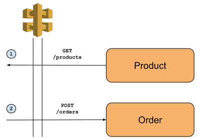

# Sofa Spud
Sofa Spud is a fictional online retailer.  The purpose of this project is to act as a reference architecture for concepts which may potentially be used in production.

## Benifits of a reference architecure
Production systems can get messy.  Even with the best development practices in the world, when software comes into contact with the real world, various factors can necessetate less-than-perfect solutions.

Production systems can also be large.  Rather than using a concept just once, it can (as should) be utalised in many places in the one system.

Maintaining a "Hello World" of each new concept provices a step on the ladder below production code, which can be used to help developers:
- Understand individual concepts used in production without having to understand every line of code around them
- Reuse production concepts without having to reverse-engineer the production code where they're used
- Experiment with new concepts using a lighter-weight sandbox than a fork of production code

## Services

The business funcationality of a system is primarily implemented using *services*.  In the context of this example, services may exist to demonstrate 

### Product service (placeholder)

Acts as a catagogue for the products available in the system.  The Product service is an example of a **container based microservice**.

### Order service (work in progress)

Allows orders to be paced for specified quantities of a product.  The Order service is an example of a **serverless microservice**.

See details of implementation [here](docs/order-service/README.md).

## Infrastructure

The services are deployed on a foundation of cloud resources.

### Network

The Network infrastruture creates a means of securely routing traffic from public APIs to private backend resources, and between backend resources.

See details of implementation [here](docs/network/README.md).

## Business flows

This section describes the various use cases offered by the system.

*Disclaimer: The business flows are simply there to demonstrate technical concepts.  They may not (and usually won't!) be the most effective way to implement functionality required by an online retainer.*

### Ordering stuff




## How to Install
The project is written using [AWS Cloud Development Kit](https://aws.amazon.com/cdk/) (CDK).

### Prerequisites
CDK requires the following:
- [AWS CLI](https://aws.amazon.com/cli/)
- [AWS Account and User](https://aws.amazon.com/account/sign-up)
- [Node.js](https://nodejs.org/en/download/)

### Install steps

Install the AWS CDK Toolkit globally using the following Node Package Manager command.
```
npm install -g aws-cdk
```

Deploy (or update) the stack on your AWS account by running:
```
cdk deploy
```

### Tear down
Don't forget - even example stacks cost money (and IPV4 addresses).  Once you're finished exploring a concept, tear down the stack using:
```
cdk destroy
```

## How to run
TODO:  Host OpenAPI specs using Swagger.  Return Swagger URL as output from stack.  Refer to that link here.
TODO:  If/when a UI is added to this stack, return UI URL as outpout from stack.  Reger to that link here.

## Documentation

The diargams in this project were created using Google Drawings.  They're available [here](https://drive.google.com/drive/folders/1sD9AlJ1TOBfzMgbZeHh8P6m9D92N_Lia?usp=sharing) for copy/modification.


