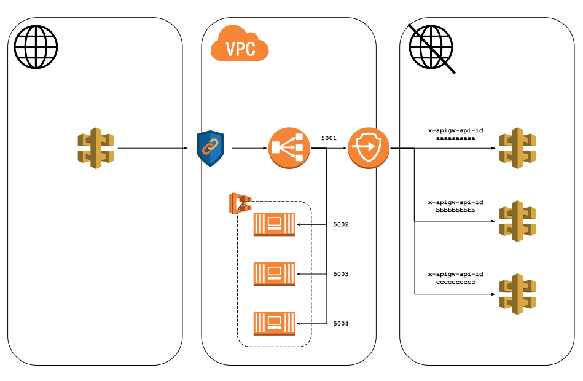

# Network
The network stack contains all the resources responsible for getting traffic between the various system components.

## Routing

### Public API Gateway
External traffic enters the system via an internet-facing [API Gateway](https://aws.amazon.com/api-gateway/).  For security reasons, this is the only internet-facing component of the entire system.  Endpoints can be added to this public gatway to target specific backend resources.

### NBL
A [Network Load Balancer](https://docs.aws.amazon.com/elasticloadbalancing/latest/network/introduction.html) (NLB) functions at the fourth layer of the Open Systems Interconnection (OSI) model. It can handle millions of requests per second.  The NLB resides inside a Virtual Private Cloud (VPC).  The public gateway sends traffic to the NLB using a VPC Link, an networking mechanism which acts as an entry point for a VPC.

The public gateway uses ports to tell the NLB which service to direct traffic to.  I.e.
- `5001 -> Service A`
- `5002 -> Service B`

### Container-based services
One option for hosting a services is via a container.  The containers can be launched in the same VPC as the NLB.  The NLB will then balance any traffic between relevant container instances.

### Private API Gateways
AWS supports the concept of [Private API Gateways](https://docs.aws.amazon.com/apigateway/latest/developerguide/apigateway-private-apis.html).  These gateways function in the same way as a regular AWS API Gateway, but can only be accessed from a VPC.  This makes them ideal for creating micorservices using serverless functions and direct calls to AWS services.

Traffic from a specified port on the NLB gets directed at a [VPC Endpoint](https://docs.aws.amazon.com/vpc/latest/privatelink/create-interface-endpoint.html) (VPCE).  This endpoint can be configured to a wide range of AWS Services (in this case AWS API Gateway).  As multiple private gateways may exist (one per microservice), the call must include a `x-apigw-api-id` header to specify which gateway to target.

#### Why via an NLB?
You might think that send traffic to an already load-balanced service (such as Lambda) is redundant, and you'd be right.  Unfortunately, at the time of creating this example, this is the only approach AWS offer for getting traffic from a public API Gateway to a private one.  A feature request has been raised with AWS and is on the API Gateway team's internal backlog.  If/when this functionality is available traffic can skip the NLB.

Technically the target group for the VPCE is made up of the IP addresses of the VPCE's [Network Interfaces](https://docs.aws.amazon.com/AWSEC2/latest/UserGuide/using-eni.html) (one per subnet), so this should make the path to the private gateway resiliant against the loss of an Availability Zone.

#### TLS

All AWS API Gateway traffic is encrypted using TLS.  Unencrypted traffic (HTTP) is not supported.  The TLS connection is terminated at the gateway.  This means that in order to send traffic to the gateway, it must have a domain which matches the TLS certificate.  Fortunately the certificate the gateway uses takes the form `*.execute-api.<region>.amazonaws.com`.  The wildcard provides the ability to allocate subdomains to the various proxies along the way.  AWS themselves use this for presenting the VPCE corresponding to the service.

Calling the NLB's default URL of `<nlb name>.elb.<region>.amazonaws.com` would result in a TLS error.  Therefore a new alias is created (using Route 53) to allow HTTPS traffic to be sent to the NLB using a domain which matches the certificate used by the gateway.
